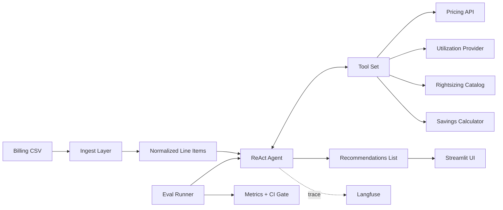

# Cloud Cost Optimizer Agent — Design Document

**Project 1 of the Agentic Patterns Series**
**Pattern:** Single-agent ReAct (tool-using loop)
**Production concern:** Structured output discipline + cost-tracked evaluation

---

## Table of Contents

1. [Executive Summary](#1-executive-summary)
2. [Goals and Non-Goals](#2-goals-and-non-goals)
3. [User Stories](#3-user-stories)
4. [Architecture](#4-architecture)
5. [Technology Stack and Rationale](#5-technology-stack-and-rationale)
6. [Data Model](#6-data-model)
7. [Agent Design](#7-agent-design)
8. [Tool Specifications](#8-tool-specifications)
9. [Provider Abstraction](#9-provider-abstraction)
10. [Evaluation Strategy](#10-evaluation-strategy)
11. [Observability](#11-observability)
12. [Demo and UX](#12-demo-and-ux)
13. [Repository Structure](#13-repository-structure)
14. [Phased Build Plan](#14-phased-build-plan)
15. [CI/CD](#15-cicd)
16. [Trade-offs and Decisions](#16-trade-offs-and-decisions)
17. [Stretch Goals](#17-stretch-goals)
18. [Definition of Done](#18-definition-of-done)

---

## 1. Executive Summary

The Cloud Cost Optimizer Agent ingests a cloud billing export (AWS Cost and Usage Report or OCI billing CSV), reasons over the line items using tool-augmented LLM calls, and produces a ranked list of cost-optimization recommendations with quantified savings, confidence scores, and implementation guidance.

The project demonstrates four production concerns in a single, focused codebase:

1. **Tool-augmented agentic reasoning** — the LLM does not hallucinate prices; it calls real APIs.
2. **Strict structured output** — every recommendation is a validated Pydantic object, not free-form text.
3. **Evaluation as a CI gate** — a golden test set runs on every PR; regressions block merge.
4. **End-to-end observability** — every agent run is traced with latency, tokens, tool calls, and cost.

It is buildable on a Mac in roughly 20–25 hours of focused work, runs entirely locally (with optional API calls to LLM providers), and produces a polished Streamlit demo plus a public eval dashboard.

---

## 2. Goals and Non-Goals

### Goals

- Identify rightsizing opportunities for over-provisioned compute resources.
- Detect orphaned/idle resources (unattached volumes, idle load balancers, stopped instances incurring storage charges).
- Recommend commitment-based discounts (Reserved Instances, Savings Plans, OCI Universal Credits) where steady-state usage justifies them.
- Recommend storage tier transitions (S3 Standard → Infrequent Access → Glacier; OCI Object Storage standard → archive).
- Produce structured, machine-readable recommendations with quantified savings.
- Provide reproducible reasoning traces so a human can audit any recommendation.

### Non-Goals

- Multi-agent coordination (that's Tier 2 and beyond).
- Automated remediation/execution (read-only by design — recommendations are surfaced, not applied).
- Real-time/streaming analysis (batch CSV input is sufficient for v1).
- Anomaly detection (separate problem space — out of scope).
- Forecasting or budget alerts (separate problem space — out of scope).

---

## 3. User Stories

**US-1.** As a FinOps practitioner, I upload my monthly billing CSV and receive a ranked list of optimization recommendations within 90 seconds, each with dollar impact and confidence.

**US-2.** As an engineering manager, I click into any recommendation and see exactly which billing line items, utilization data, and pricing lookups led to the recommendation.

**US-3.** As a developer auditing the system, I open a Langfuse trace and see every LLM call, every tool call, every input/output, and the full token/cost accounting for the run.

**US-4.** As a contributor, I open a PR; CI runs the eval suite against a golden set; if recommendation accuracy drops below threshold, the PR is blocked.

---

## 4. Architecture



### Data Flow

1. User uploads a billing CSV via Streamlit (or it's loaded from `data/` for evals).
2. The **Ingest Layer** normalizes provider-specific schemas into a `BillingLineItem` Pydantic model.
3. The **Aggregator** groups line items by resource and computes monthly cost, usage hours, and utilization where available.
4. The **Agent** receives a candidate set of resources (prefiltered to top-N by cost to bound token usage) and iterates through them, calling tools as needed.
5. For each resource, the agent emits zero or more `Recommendation` objects, validated against the schema.
6. The **UI** renders recommendations sorted by `annual_savings_usd`, with drill-down to the reasoning trace.
7. **Langfuse** captures every LLM call, tool call, and final output for observability.

### Why this architecture

The ingest/normalize/aggregate split is deliberate: the LLM only sees aggregated, prefiltered data. Sending 10,000 raw line items to the LLM would be expensive and noisy. Sending the top 50 resources by cost, pre-aggregated, gives the LLM a tractable problem and bounds cost predictably.

---

## 5. Technology Stack and Rationale

| Layer | Choice | Why |
|---|---|---|
| Agent framework | **LangGraph** | Same framework will power Tier 2–4 projects; single-agent is just a one-node graph. Avoids framework sprawl across the portfolio series. |
| LLM (primary) | **Anthropic Claude Sonnet 4.5** | Strong tool-use, long context for billing data, reliable structured output. |
| LLM (alternates) | OpenAI GPT-4.1, Ollama llama3.1:8b | Provider abstraction allows swap; local model proves cost-sensitivity story in README. |
| Output validation | **Pydantic v2** | Type safety; native LangGraph integration; serializes cleanly to JSON. |
| Tool retry/fallback | **Instructor** patterns | For tool calls that need structured retry logic. |
| Vector store | None for v1 | RAG is Project 2; this project deliberately avoids it to keep the focus tight. |
| Observability | **Langfuse (self-hosted)** | Open source, runs in Docker, no cloud account needed. |
| Demo UI | **Streamlit** | Industry standard for ML demos; recruiters recognize it; fast to build. |
| Eval framework | **Custom + PromptFoo** | PromptFoo for declarative assertions; custom harness for recommendation-quality metrics. |
| Pricing data | **AWS Pricing API** (real), OCI pricing JSON (real) | Both are free and public — no auth required. |
| Utilization data | **Mocked + optional CloudWatch** | Mocked by default; real CloudWatch as a stretch. |
| CI | **GitHub Actions** | Free, ubiquitous. |
| Package manager | **uv** | Fast, modern; works well on macOS. |
| Python version | **3.11+** | Type hint maturity; `match` statements; performance. |

### Why LangGraph over Pydantic AI for this specific project

Pydantic AI is arguably cleaner for a single-agent project. The decision to use LangGraph here is *strategic, not tactical* — Tier 2–4 projects need LangGraph's graph primitives (state, conditional edges, checkpoints), and using two frameworks across the series fragments the learning. One framework, deepening over 10 projects, reads as expertise. Two frameworks reads as exploration.

---

## 6. Data Model

All data models live in `src/cost_optimizer/models.py`. These are the primary types.

### `BillingLineItem`

```python
class BillingLineItem(BaseModel):
    """Provider-agnostic billing line item."""
    line_item_id: str
    provider: Literal["aws", "oci", "gcp", "azure"]
    service: str                      # "EC2", "S3", "Compute", "ObjectStorage"
    resource_id: str | None           # e.g., i-0abc123 or ocid1.instance.oc1...
    resource_type: str | None         # "t3.large", "VM.Standard.E4.Flex"
    region: str
    usage_start: datetime
    usage_end: datetime
    usage_amount: float
    usage_unit: str                   # "Hrs", "GB-Mo", "Requests"
    unblended_cost_usd: float
    tags: dict[str, str] = {}
```

### `ResourceSummary`

The aggregated view the agent sees:

```python
class ResourceSummary(BaseModel):
    resource_id: str
    provider: Literal["aws", "oci", "gcp", "azure"]
    service: str
    resource_type: str | None
    region: str
    monthly_cost_usd: float
    usage_hours: float
    utilization: UtilizationStats | None  # None if not measured
    tags: dict[str, str] = {}
```

### `UtilizationStats`

```python
class UtilizationStats(BaseModel):
    cpu_p50: float | None
    cpu_p95: float | None
    memory_p50: float | None
    memory_p95: float | None
    network_in_gb_per_day: float | None
    network_out_gb_per_day: float | None
    measurement_window_days: int
    data_source: Literal["cloudwatch", "oci_monitoring", "mocked"]
```

### `Recommendation` (the core output)

```python
class Recommendation(BaseModel):
    recommendation_id: str            # uuid4
    type: RecommendationType          # enum below
    resource_id: str
    resource_type: str | None
    region: str

    current_state: dict[str, Any]
    recommended_state: dict[str, Any]

    monthly_savings_usd: float
    annual_savings_usd: float
    confidence: float = Field(ge=0.0, le=1.0)
    effort: Literal["low", "medium", "high"]
    risk_level: Literal["low", "medium", "high"]

    reasoning: str                    # human-readable narrative, 2-5 sentences
    evidence: list[Evidence]          # specific data points that support the rec
    prerequisites: list[str]          # what must be true before applying
    rollback_plan: str | None

    generated_at: datetime
    agent_version: str
    trace_id: str | None              # links to Langfuse trace

class RecommendationType(str, Enum):
    RIGHTSIZE = "rightsize"
    TERMINATE_IDLE = "terminate_idle"
    PURCHASE_COMMITMENT = "purchase_commitment"
    STORAGE_TIER_TRANSITION = "storage_tier_transition"
    DELETE_ORPHANED = "delete_orphaned"
    SCHEDULE_SHUTDOWN = "schedule_shutdown"

class Evidence(BaseModel):
    description: str
    source: Literal["billing", "utilization", "pricing_api", "rightsizing_catalog"]
    data: dict[str, Any]
```

The `Recommendation` schema is the contract between the agent and everything else. The Streamlit UI, the eval harness, and any future API endpoint all consume this schema. Changes are versioned via `agent_version`.

---

## 7. Agent Design

### Reasoning Loop

The agent uses a constrained ReAct loop:

1. Receive a single `ResourceSummary` (one resource per agent invocation — important for cost predictability).
2. Decide which tools (if any) to call to gather more information.
3. Execute tool calls; receive results.
4. Either call more tools or emit zero-to-N `Recommendation` objects.
5. Stop. The loop is bounded to a maximum of 6 tool calls per resource (configurable).

The entire batch run is a `for` loop over resources, not a single megaprompt. This keeps token usage linear and predictable, makes failures isolated, and allows parallel execution of independent resources later.

### System Prompt (abbreviated)

The full prompt lives in `src/cost_optimizer/prompts/system.md`. The structure:

```markdown
You are a senior cloud cost optimization analyst. You analyze a single cloud
resource and produce 0-N recommendations to reduce its cost without
materially impacting reliability or performance.

## Operating principles

1. Never recommend changes based on assumed prices. Always call the
   pricing tool to verify current rates.
2. Never recommend rightsizing without utilization data. If utilization
   is unknown, call get_utilization_stats first. If still unknown, do not
   recommend rightsizing — recommend "investigate" instead with confidence < 0.5.
3. Confidence calibration matters: 0.9+ means "I would bet on this."
   0.5-0.7 means "worth investigating but not certain." Below 0.5 means
   "weak signal, treat as a hypothesis."
4. Risk level reflects blast radius if the recommendation is wrong.
   Terminating a stopped instance with no recent activity = low risk.
   Rightsizing a production database = high risk regardless of utilization.
5. Be specific in reasoning. "This instance is underutilized" is not a
   reason. "CPU p95 over 30 days is 14% on a t3.xlarge" is.

## Available tools
[list of tool names, descriptions, parameters]

## Output schema
You must emit a list of Recommendation objects matching this Pydantic model.
[schema inserted here]
```

### Tool-Use Discipline

The agent is bound to a set of tools and **prohibited from emitting prices, instance specifications, or utilization claims that did not come from a tool call**. This is enforced two ways:

- **Prompt-level**: explicit operating principles in the system prompt.
- **Validation-level**: the `Evidence` field on `Recommendation` requires a `source` enum; a post-generation validator checks that any numeric claim in `reasoning` is corroborated by an entry in `evidence`. If not, the recommendation is rejected and the agent is given one retry with feedback.

This is the *production discipline* this project showcases. Most portfolio agents skip it.

---

## 8. Tool Specifications

All tools live in `src/cost_optimizer/tools/`. Each tool is a typed Python function with a docstring; LangGraph turns the docstring into the tool description.

### `get_aws_pricing`

```python
def get_aws_pricing(
    instance_type: str,
    region: str,
    operating_system: Literal["Linux", "Windows"] = "Linux",
    tenancy: Literal["Shared", "Dedicated"] = "Shared",
) -> AwsPricingResult:
    """Fetch on-demand, 1-year RI, 3-year RI, and Compute Savings Plan
    pricing for an EC2 instance type in a region. Returns USD per hour
    for each pricing model."""
```

Backed by AWS Pricing API (`https://pricing.us-east-1.amazonaws.com/`) — no authentication required. Cached on disk via `diskcache` to avoid repeated calls during eval runs.

### `get_oci_pricing`

```python
def get_oci_pricing(shape: str, region: str) -> OciPricingResult:
    """Fetch OCI compute pricing for a shape. Returns USD per OCPU per hour
    and USD per GB-memory per hour, plus Universal Credit discount tiers."""
```

Backed by OCI's public pricing JSON.

### `get_utilization_stats`

```python
def get_utilization_stats(
    resource_id: str,
    provider: str,
    days: int = 30,
) -> UtilizationStats:
    """Fetch CPU, memory, and network utilization percentiles for a
    resource over the past N days. Returns mocked data unless
    USE_REAL_CLOUDWATCH=1 is set in the environment."""
```

Mocked behavior: returns deterministic synthetic data based on a hash of `resource_id` so eval runs are reproducible. The mock includes intentional patterns (some resources are clearly idle, some are clearly hot) so the agent has signal.

### `get_rightsizing_options`

```python
def get_rightsizing_options(
    instance_type: str,
    target_cpu_utilization: float = 0.6,
) -> list[InstanceOption]:
    """Given an instance type and a target utilization, return a list of
    smaller instances in the same family that could absorb the workload.
    Sorted by hourly cost ascending."""
```

Backed by a static catalog of instance families + an interpolation function. Static is fine — instance families don't change weekly.

### `calculate_commitment_savings`

```python
def calculate_commitment_savings(
    monthly_on_demand_cost_usd: float,
    instance_type: str,
    region: str,
    term_years: Literal[1, 3] = 1,
    payment: Literal["no_upfront", "partial_upfront", "all_upfront"] = "no_upfront",
) -> CommitmentSavingsResult:
    """Compute the savings from converting on-demand spend to a
    Reserved Instance or Savings Plan over the given term."""
```

Pure calculation; calls `get_aws_pricing` internally.

### `check_idle_signals`

```python
def check_idle_signals(resource: ResourceSummary) -> IdleSignalResult:
    """Heuristic detector for idle/orphaned resources: stopped EC2 with
    EBS attached, unattached EBS volumes, idle load balancers (low conn
    count), unused elastic IPs."""
```

---

## 9. Provider Abstraction

The system is multi-cloud from day one, even though the v1 demo focuses on AWS.

```python
class BillingProvider(Protocol):
    name: str

    def parse_csv(self, path: Path) -> list[BillingLineItem]: ...
    def aggregate(self, items: list[BillingLineItem]) -> list[ResourceSummary]: ...
    def get_pricing_tool(self) -> Callable: ...
    def get_utilization_tool(self) -> Callable: ...
```

Concrete implementations: `AwsProvider`, `OciProvider`. The agent receives a list of tools from `provider.get_pricing_tool()` etc., so the same agent code handles both clouds without modification.

This is the architectural choice that signals senior thinking. A reviewer reading the repo sees: *"this person designed for multi-cloud from the start, not as an afterthought."*

---

## 10. Evaluation Strategy

### Golden Set

`evals/golden_set.json` contains 50 hand-curated test cases. Each case:

```json
{
  "case_id": "aws-rightsize-001",
  "description": "t3.xlarge with 12% p95 CPU should rightsize to t3.medium",
  "input_resource": { /* ResourceSummary */ },
  "input_utilization": { /* UtilizationStats */ },
  "expected_recommendations": [
    {
      "type": "rightsize",
      "recommended_instance_type": "t3.medium",
      "min_savings_usd_monthly": 30.0,
      "min_confidence": 0.7,
      "max_risk_level": "medium"
    }
  ],
  "negative_assertions": [
    "Should NOT recommend terminate_idle (instance is in use)"
  ]
}
```

Cases cover:
- Clear rightsizing wins (10)
- Clear idle/orphaned resources (10)
- Commitment-purchase candidates (8)
- Storage tier transitions (7)
- Negative cases — should NOT recommend changes (10)
- Edge cases — missing utilization, weird tags, very small spend (5)

### Metrics

| Metric | How computed | Target |
|---|---|---|
| Recommendation precision | TP / (TP + FP) where TP = expected rec emitted, FP = unexpected rec emitted | ≥ 0.85 |
| Recommendation recall | TP / (TP + FN) | ≥ 0.80 |
| Savings estimate accuracy | mean(\|predicted - actual\|/actual) on cases with known ground truth | ≤ 0.20 |
| Confidence calibration | Brier score on confidence vs. correctness | ≤ 0.20 |
| Negative-assertion pass rate | % of negative assertions satisfied | ≥ 0.95 |
| Mean tool calls per resource | from traces | ≤ 4.0 |
| p95 latency per resource | from traces | ≤ 12s |
| Mean cost per resource | tokens × $/token | ≤ $0.05 |

### Eval Runner

`evals/eval_runner.py` loads the golden set, runs the agent against each case (with caching to avoid LLM costs on unchanged code), compares output to expected, and emits a JSON report plus a markdown summary suitable for posting as a PR comment.

A `--baseline` flag compares the current run against a stored baseline; CI fails if any metric regresses by more than 5%.

---

## 11. Observability

### Langfuse Self-Hosted

`docker-compose.yml` brings up Langfuse + Postgres locally. The agent emits traces via the Langfuse SDK; every LLM call, every tool call, and every Recommendation is captured with parent/child relationships.

Each trace includes:
- Input `ResourceSummary`
- Sequence of LLM calls with token counts and latencies
- Sequence of tool calls with inputs/outputs
- Final list of Recommendations
- Total cost (computed from token counts × model pricing)
- Total latency

The Streamlit UI links each rendered recommendation to its Langfuse trace via `trace_id`.

### Cost Tracking

The README publishes a "cost per analysis" number derived from the eval suite. This is itself a portfolio differentiator — most demo agents don't tell you what they cost to run.

### Quality Tracking

A dashboard (Langfuse's built-in or a Streamlit page in `app/eval_dashboard.py`) shows precision/recall trends over time as the prompt and code evolve. Useful both as a development tool and as a public artifact in the README.

---

## 12. Demo and UX

### Streamlit App Layout

**Sidebar:**
- Provider selector (AWS / OCI)
- File uploader for billing CSV
- Top-N resources to analyze (default 50)
- Model selector (Claude / GPT / local Ollama)
- "Run analysis" button

**Main panel:**
- Tab 1: **Recommendations** — sortable table with filters by type, risk, confidence; drill-down into reasoning and evidence.
- Tab 2: **Resource browser** — paginated view of all resources with cost and utilization.
- Tab 3: **Run summary** — total potential savings, breakdown by recommendation type, cost-of-analysis, links to Langfuse traces.
- Tab 4: **About** — architecture diagram, eval results, link to GitHub.

### Demo Script (90-second video)

1. Upload `data/sample_aws_cur.csv` (a real-shaped sample with ~200 resources).
2. Click Run; watch recommendations stream in.
3. Click on the top recommendation; show the reasoning, evidence, and Langfuse trace link.
4. Switch to the Run Summary tab; show total potential savings ($X,XXX/year) and cost of analysis ($0.YY).
5. Cut to the GitHub Actions tab; show the eval suite passing on the latest PR.

This is the artifact you send a recruiter. Loom video, embedded in the README, autoplays muted.

---

## 13. Repository Structure

```
cost-optimizer-agent/
├── README.md                        # public-facing; subset of this doc
├── DESIGN.md                        # this document
├── pyproject.toml                   # uv/pip config
├── .env.example                     # API keys, Langfuse URL
├── docker-compose.yml               # Langfuse + Postgres
├── Makefile                         # common tasks: install, test, eval, serve
│
├── src/cost_optimizer/
│   ├── __init__.py
│   ├── models.py                    # Pydantic schemas
│   ├── agent.py                     # LangGraph agent definition
│   ├── runner.py                    # batch orchestrator
│   ├── observability.py             # Langfuse setup
│   │
│   ├── prompts/
│   │   ├── system.md                # main system prompt
│   │   └── examples.md              # few-shot examples
│   │
│   ├── tools/
│   │   ├── __init__.py
│   │   ├── pricing.py               # AWS + OCI pricing tools
│   │   ├── utilization.py           # mocked + real CloudWatch
│   │   ├── rightsizing.py           # instance family catalog
│   │   ├── savings.py               # commitment calculations
│   │   └── idle.py                  # idle/orphan detection
│   │
│   ├── providers/
│   │   ├── __init__.py
│   │   ├── base.py                  # Protocol
│   │   ├── aws.py
│   │   └── oci.py
│   │
│   └── ingest/
│       ├── __init__.py
│       ├── aws_cur.py               # parses AWS Cost and Usage Reports
│       └── oci_billing.py           # parses OCI billing exports
│
├── app/
│   ├── streamlit_app.py             # main demo
│   └── eval_dashboard.py            # quality trends
│
├── evals/
│   ├── golden_set.json              # 50 cases
│   ├── eval_runner.py
│   ├── metrics.py
│   ├── baseline.json                # last accepted scores
│   └── reports/                     # generated per-run
│
├── tests/
│   ├── test_models.py
│   ├── test_ingest.py
│   ├── test_tools.py
│   ├── test_providers.py
│   └── test_agent.py
│
├── data/
│   ├── sample_aws_cur.csv
│   └── sample_oci_billing.csv
│
└── .github/workflows/
    ├── test.yml                     # pytest on push
    └── eval.yml                     # eval suite on PR
```

---

## 14. Phased Build Plan

Estimated total: **20–25 hours** of focused work.

### Phase 0 — Scaffolding (2h)

- `uv init`, dependency setup
- Repo structure, Makefile, `.env.example`
- `docker-compose up` for Langfuse, verify it works
- `README.md` skeleton with placeholders

**Acceptance:** `make install`, `make langfuse` both work.

### Phase 1 — Models and Ingest (3h)

- All Pydantic models from §6
- AWS CUR parser
- OCI billing parser
- Sample data files committed
- Unit tests for ingest (`tests/test_ingest.py`)

**Acceptance:** `python -m cost_optimizer.ingest.aws_cur data/sample_aws_cur.csv` prints normalized line items.

### Phase 2 — Tools (4h)

- All tools from §8 implemented
- AWS Pricing API integration with disk caching
- OCI pricing JSON loader
- Mocked utilization with deterministic synthetic patterns
- Unit tests for tools

**Acceptance:** Each tool callable directly, returns valid Pydantic objects.

### Phase 3 — Agent (5h)

- LangGraph single-node agent
- System prompt finalized
- Tool binding and ReAct loop
- Provider abstraction wired up
- Recommendation post-validation (evidence corroboration check)
- End-to-end run on 5 resources, hand-inspect output

**Acceptance:** `python -m cost_optimizer.runner data/sample_aws_cur.csv` produces a list of valid `Recommendation` objects.

### Phase 4 — Streamlit Demo (3h)

- All four tabs from §12
- File upload, model selector, run button
- Recommendation drill-down with evidence display
- Trace links to Langfuse

**Acceptance:** End-to-end demo from upload to recommendation drill-down works on `data/sample_aws_cur.csv`.

### Phase 5 — Eval Harness (4h)

- Golden set authored (50 cases — this is the time sink)
- Eval runner with caching
- Metrics computation
- Baseline comparison logic
- Markdown report generator

**Acceptance:** `make eval` produces a report; precision and recall meet targets in §10.

### Phase 6 — Observability Polish (2h)

- Langfuse traces verified for every run
- Cost-per-analysis computed and surfaced
- Eval dashboard Streamlit page

**Acceptance:** A trace link from a Streamlit recommendation lands on the correct Langfuse view.

### Phase 7 — CI and README (2h)

- `test.yml` runs pytest on every push
- `eval.yml` runs eval suite on PRs and posts the markdown report as a comment
- README rewritten with hook, screenshots, demo video link, eval results, quickstart
- Architecture diagram embedded

**Acceptance:** A test PR shows green CI with eval results commented inline.

### Phase 8 — Demo Recording (1h)

- 90-second Loom following the script in §12
- Embed link in README

**Acceptance:** Recruiter-quality artifact.

---

## 15. CI/CD

### `test.yml`

```yaml
on: [push, pull_request]
jobs:
  test:
    runs-on: ubuntu-latest
    steps:
      - uses: actions/checkout@v4
      - uses: astral-sh/setup-uv@v4
      - run: uv sync
      - run: uv run pytest -v
```

### `eval.yml`

```yaml
on: pull_request
jobs:
  eval:
    runs-on: ubuntu-latest
    steps:
      - uses: actions/checkout@v4
      - uses: astral-sh/setup-uv@v4
      - run: uv sync
      - run: uv run python -m evals.eval_runner --baseline evals/baseline.json
        env:
          ANTHROPIC_API_KEY: ${{ secrets.ANTHROPIC_API_KEY }}
      - uses: actions/github-script@v7
        with:
          script: |
            const fs = require('fs');
            const report = fs.readFileSync('evals/reports/latest.md', 'utf8');
            github.rest.issues.createComment({
              issue_number: context.issue.number,
              owner: context.repo.owner,
              repo: context.repo.repo,
              body: report
            });
```

The eval workflow uses cached LLM responses where the input is unchanged, keeping the API spend per CI run under $0.50.

---

## 16. Trade-offs and Decisions

**Single-resource-at-a-time vs. batch megaprompt.** Per-resource is more expensive (more LLM round-trips) but bounded, parallelizable, and resilient to single-resource failures. Megaprompt is cheaper but unpredictable in cost and hard to debug. *Decision: per-resource, with optional parallelism.*

**Mocked utilization vs. real CloudWatch.** Real is impressive but requires AWS credentials, which complicates the public demo. *Decision: mocked by default with deterministic synthetic patterns; real as an opt-in env var.*

**Streamlit vs. FastAPI + React.** FastAPI + React looks more "production." Streamlit ships in 3 hours. *Decision: Streamlit for v1; FastAPI as a stretch goal if a recruiter asks for a REST surface.*

**Read-only by design.** Many "cost optimizer" tools execute changes. This one does not. Justification in README: agentic execution against production cloud accounts is a risk-management problem that requires more than a portfolio project's worth of work. The right boundary for v1 is "advise, don't act."

**LangGraph vs. Pydantic AI.** Covered in §5. LangGraph wins on portfolio coherence even though Pydantic AI would be slightly cleaner here.

**No RAG.** Project 2 is the RAG project. Keeping this one tool-augmented but RAG-free makes the difference between projects clearer in the portfolio narrative.

---

## 17. Stretch Goals

These are explicit non-requirements for v1, listed in priority order for a v2:

1. **Real CloudWatch / OCI Monitoring integration** — proves the same pipeline works on live data.
2. **OCI provider end-to-end demo** — leverages your domain expertise; differentiates from AWS-only demos.
3. **FastAPI REST surface** — for recruiters who ask "could this be a service?"
4. **Slack notification integration** — daily summary of new recommendations.
5. **Recommendation diffing** — track which recs persist across runs vs. resolve.
6. **Multi-account aggregation** — handle organizations with N accounts.
7. **Anomaly detection layer** — separate agent (Project 1.5?) that watches for cost spikes.

---

## 18. Definition of Done

This project is "done" when all of the following are true:

- [ ] `make install && make demo` brings up Streamlit and the demo runs end-to-end on the sample CSV.
- [ ] `make eval` runs the golden set; precision ≥ 0.85, recall ≥ 0.80, all metrics in §10 met.
- [ ] `make test` passes with ≥ 80% code coverage.
- [ ] A test PR shows the eval report posted as a CI comment.
- [ ] Langfuse trace IDs appear on every recommendation in the UI and link correctly.
- [ ] README has: hook, architecture diagram, demo video, quickstart, eval results table, cost-per-analysis number, link to DESIGN.md.
- [ ] Repo is pinned to the GitHub org "Agentic Patterns Series" and cross-linked from the org README.
- [ ] 90-second Loom demo recorded and linked.
- [ ] OCI provider implementation at parity with AWS for at least the rightsizing case (your differentiator).

---

## Appendix A — System Prompt Skeleton

The full prompt is in `src/cost_optimizer/prompts/system.md`. Skeleton:

```
ROLE: Senior cloud cost optimization analyst.

TASK: Given one cloud resource, produce 0-N recommendations to reduce its
cost without harming reliability or performance. Each recommendation must
be a valid Recommendation object per the schema below.

OPERATING PRINCIPLES:
[5 principles from §7]

AVAILABLE TOOLS:
[auto-generated from tool docstrings]

OUTPUT SCHEMA:
[Recommendation Pydantic schema]

EXAMPLES:
[3 worked examples — rightsize, idle terminate, commitment buy]

CONSTRAINTS:
- Maximum 6 tool calls per resource.
- Every numeric claim in `reasoning` must appear in `evidence`.
- If you lack data to recommend with confidence ≥ 0.5, emit zero recommendations rather than a low-confidence guess.

INPUT (this turn):
[ResourceSummary JSON]
```

## Appendix B — Sample Recommendation Output

```json
{
  "recommendation_id": "rec_8f3a2b1e",
  "type": "rightsize",
  "resource_id": "i-0abc123def456",
  "resource_type": "t3.xlarge",
  "region": "us-east-1",
  "current_state": {
    "instance_type": "t3.xlarge",
    "vcpu": 4,
    "memory_gib": 16,
    "monthly_cost_usd": 121.18
  },
  "recommended_state": {
    "instance_type": "t3.medium",
    "vcpu": 2,
    "memory_gib": 4,
    "monthly_cost_usd": 30.30
  },
  "monthly_savings_usd": 90.88,
  "annual_savings_usd": 1090.56,
  "confidence": 0.86,
  "effort": "low",
  "risk_level": "medium",
  "reasoning": "Instance shows CPU p95 of 14% and memory p95 of 22% over the last 30 days. A t3.medium provides sufficient headroom (3.6x current p95 CPU) while reducing cost by 75%.",
  "evidence": [
    {
      "description": "30-day CPU p95",
      "source": "utilization",
      "data": { "value": 14.2, "unit": "percent" }
    },
    {
      "description": "Current on-demand price",
      "source": "pricing_api",
      "data": { "instance_type": "t3.xlarge", "region": "us-east-1", "usd_per_hour": 0.1664 }
    },
    {
      "description": "Target on-demand price",
      "source": "pricing_api",
      "data": { "instance_type": "t3.medium", "region": "us-east-1", "usd_per_hour": 0.0416 }
    }
  ],
  "prerequisites": [
    "Verify application memory ceiling via load testing",
    "Confirm no burstable workload spikes outside the 30-day window"
  ],
  "rollback_plan": "Stop instance, change instance type back to t3.xlarge, start instance. Downtime ~3 minutes.",
  "generated_at": "2026-05-06T14:23:00Z",
  "agent_version": "0.1.0",
  "trace_id": "lf_trace_a4b8c1"
}
```

This is what success looks like, line by line.
